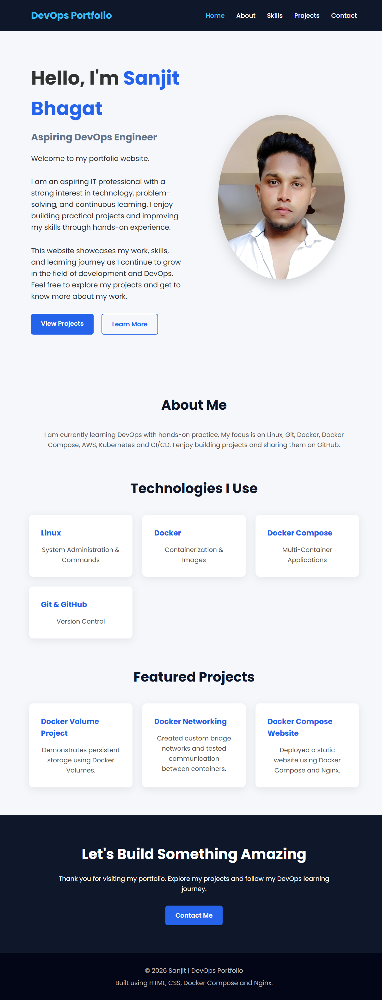
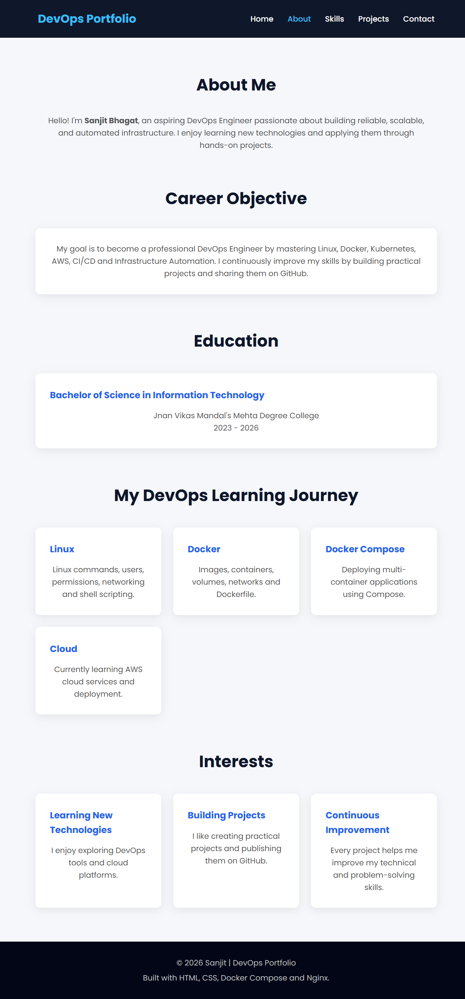
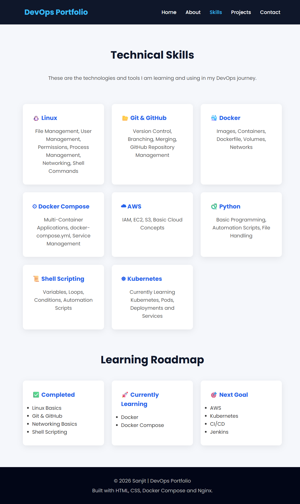
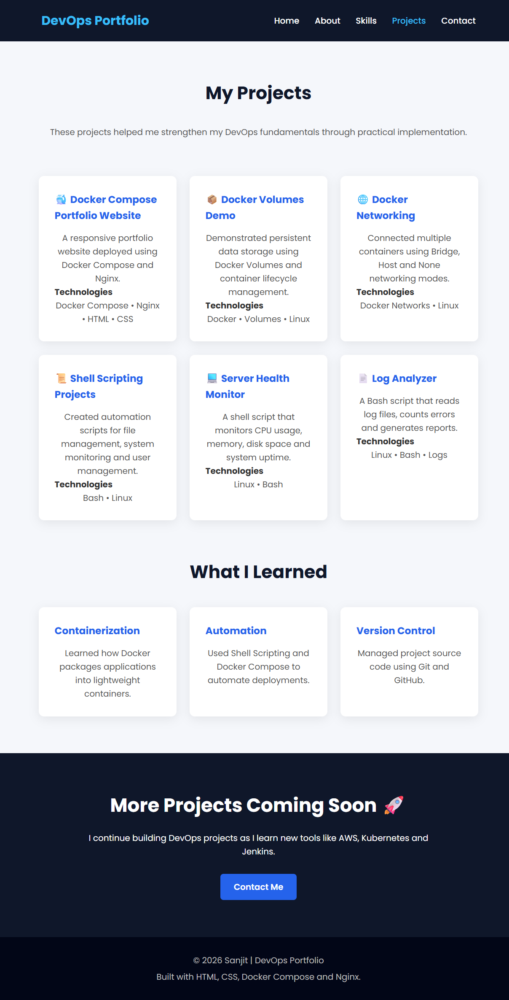
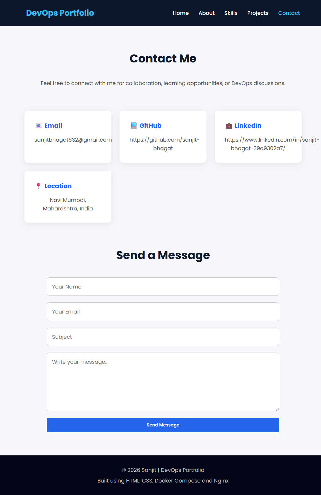

# 🚀 Personal Portfolio Website

A responsive personal portfolio website deployed using **Docker Compose** and **Nginx**. This project demonstrates how to host a static website inside a Docker container using a single `docker-compose.yml` file.

---

## 📌 Project Overview

This project was created to practice **Docker Compose** by deploying a multi-page portfolio website.

The website includes:

- 🏠 Home
- 👤 About
- 💻 Skills
- 📂 Projects
- 📞 Contact

The application is served by **Nginx** and managed with **Docker Compose**.

---

## 🛠 Technologies Used

- Docker
- Docker Compose
- Nginx
- HTML5
- CSS3

---

## 📁 Project Structure

```text
Personal-Portfolio-Website/
│
├── docker-compose.yml
├── README.md
│
├── website/
│   ├── index.html
│   ├── about.html
│   ├── skills.html
│   ├── projects.html
│   ├── contact.html
│   ├── style.css
│   └── images/
│       └── profile.jpeg
│
└── screenshots/
    ├── home-page.png
    ├── about-page.png
    ├── skills-page.png
    ├── projects-page.png
    └── contact-page.png
```

---

## ⚙️ Prerequisites

Before running this project, make sure you have:

- Docker installed
- Docker Compose available

---

## ▶️ Run the Project

Clone the repository:

```bash
git clone https://github.com/your-username/docker-compose-portfolio.git
```

Go to the project directory:

```bash
cd docker-compose-portfolio
```

Start the application:

```bash
docker compose up -d
```

---

## 🌐 Open in Browser

Visit:

```
http://localhost:8080
```

---

## 📋 Docker Compose Commands

Start the application

```bash
docker compose up -d
```

View running containers

```bash
docker compose ps
```

View logs

```bash
docker compose logs
```

Restart services

```bash
docker compose restart
```

Stop services

```bash
docker compose stop
```

Start stopped services

```bash
docker compose start
```

Stop and remove containers

```bash
docker compose down
```

---

## ✨ Features

- Responsive design
- Multi-page website
- Professional navigation bar
- Docker Compose deployment
- Nginx web server
- Volume mounting for live updates
- Simple project structure

---

## 📷 Screenshots

### Home Page



### About Page



### Skills Page



### Projects Page



### Contact Page



---

## 📚 Learning Outcomes

Through this project, I learned:

- Creating a Docker Compose configuration
- Hosting a static website using Nginx
- Port mapping
- Volume mounting
- Managing containers with Docker Compose
- Organizing a multi-page website

---

## 👨‍💻 Author

**Sanjit Bhagat**

Aspiring DevOps Engineer

GitHub: https://github.com/sanjit-bhagat

LinkedIn: https://www.linkedin.com/in/sanjit-bhagat-39a9302a7/

---

## 📄 License

This project is created for learning purposes and is free to use.

⭐ If you found this project helpful, consider giving it a star on GitHub.
