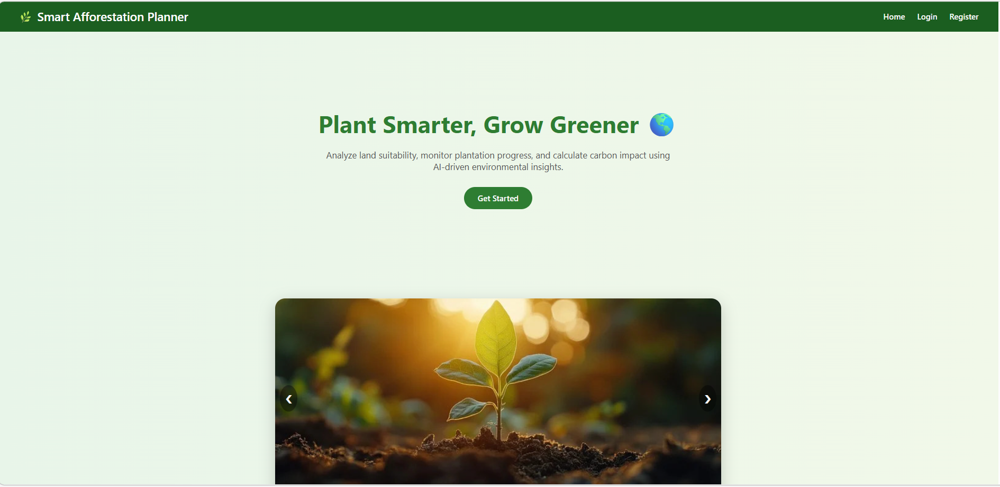
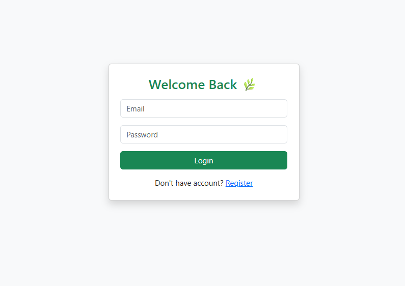
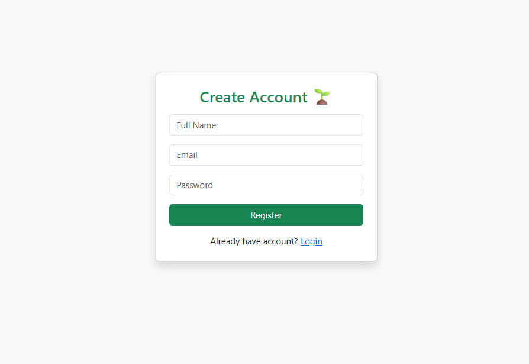
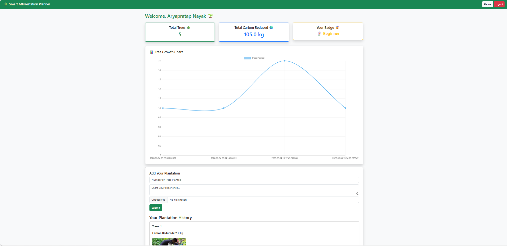
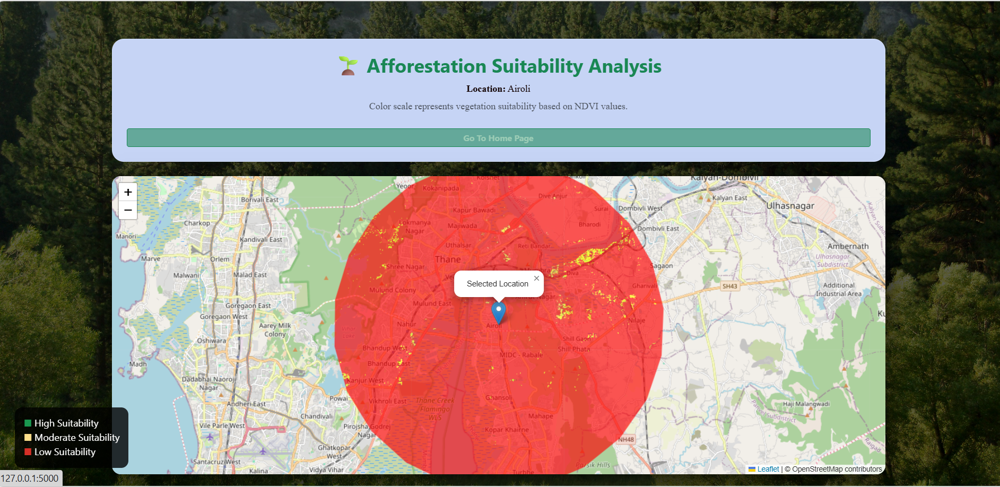
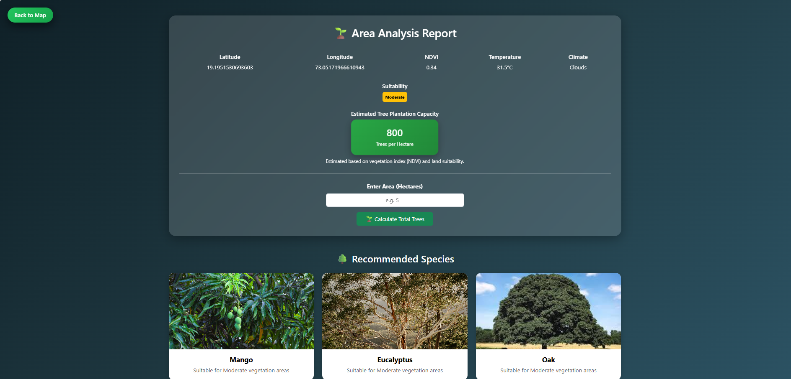
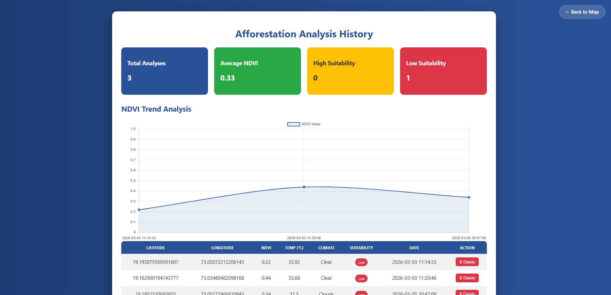

# 🌳 Smart Afforestation Planner

A web-based application that helps users identify suitable locations for tree plantation using satellite vegetation data (NDVI) and weather information. The platform also allows users to track their plantation activities, monitor environmental contributions, and engage with a community of tree planters.

## 📖 About the Project

Deforestation and climate change are major environmental challenges today. Many people are willing to plant trees but often lack information about where and what to plant.

The **Smart Afforestation Planner** addresses this problem by combining geospatial analysis with a simple web interface. Users can analyze plantation suitability, record plantation activities, upload images, earn certificates, and share their contributions with the community.

This project was developed as a final-year engineering project by:

- **Aryapratap M. Nayak**
- **Sanjit S. Bhagat**

---

## ✨ Features

- 🔐 User Registration & Login
- 🌍 Location-based Plantation Planning
- 🛰️ NDVI-based Land Suitability Analysis
- 🌦️ Real-time Weather Information
- 🌱 Recommended Tree Species
- 📊 Dashboard with Plantation Statistics
- 🌳 Carbon Reduction Calculation
- 🖼️ Plantation Image Upload
- 🏆 Achievement Badges
- 📜 Dynamic Certificate Generation
- 👥 Community Feed
- ❤️ Like System for Community Posts
- 📈 Plantation History & Growth Charts

---

## 🛠️ Tech Stack

### Frontend
- HTML5
- CSS3
- Bootstrap 5
- JavaScript
- Chart.js

### Backend
- Python
- Flask

### Database
- SQLite

### APIs & Services
- Google Earth Engine
- OpenWeather API
- Geopy (Nominatim)

---

## 📂 Project Structure

```text
Smart-Afforestation-Planner/
│
├── static/
│   ├── css/
│   ├── uploads/
│   └── image/
│
├── templates/
│   ├── landing.html
│   ├── login.html
│   ├── register.html
│   ├── dashboard.html
│   ├── community.html
│   ├── certificate.html
│   └── ...
│
├── database/
│   └── trees.db
│
├── app.py
├── Config.py
├── requirements.txt
└── README.md
```

---

## 🚀 Getting Started

### 1. Clone the repository

```bash
git clone https://github.com/your-username/Smart-Afforestation-Planner.git
```

### 2. Move into the project

```bash
cd Smart-Afforestation-Planner
```

### 3. Create a virtual environment

```bash
python -m venv venv
```

### 4. Activate the virtual environment

Windows

```bash
venv\Scripts\activate
```

Linux / macOS

```bash
source venv/bin/activate
```

### 5. Install dependencies

```bash
pip install -r requirements.txt
```

### 6. Configure API Keys

Create or update your `Config.py` file.

```python
OPENWEATHER_API_KEY = "YOUR_API_KEY"
SECRET_KEY = "YOUR_SECRET_KEY"
```

### 7. Run the application

```bash
python app.py
```

Open your browser and visit:

```
http://127.0.0.1:5000
```

---

## 📷 Main Modules

- User Authentication
- Plantation Planner
- NDVI Analysis
- Weather Integration
- Dashboard
- Community Feed
- Certificate Generation
- Plantation History

---

## 🌱 Future Improvements

- AI-based tree recommendation
- Mobile application
- GPS-based plantation tracking
- Email notifications
- Gamification with rewards
- Admin dashboard
- Leaderboard improvements

---

## 🎯 Project Objective

To encourage environmental sustainability by providing users with a digital platform that helps them make informed plantation decisions using satellite data and weather analysis while motivating them through dashboards, certificates, and community participation.

---

## 📸 Project Screenshots

### 🏠 Landing Page
The landing page introduces the Smart Afforestation Planner and provides navigation to the login and registration pages.



---

### 🔐 Login Page
Users can securely log in to access their dashboard and plantation records.



---

### 📝 Register Page
New users can create an account by providing their name, email, and password.



---

### 📊 Dashboard
Displays the user's plantation statistics, carbon reduction, badges, plantation history, and certificate downloads.



---

### 🌍 Suitability Analysis
Analyzes the selected location using NDVI satellite data and weather information to determine plantation suitability.



---

### 📋 Area Analysis Report
Shows the detailed environmental analysis report, including vegetation status, weather conditions, and plantation recommendations.



---

### 📜 Analysis History
Displays previously analyzed locations, allowing users to revisit and compare past plantation analyses.



---

## 👨‍💻 Authors

**Aryapratap M. Nayak**

**Sanjit S. Bhagat**

Final Year Engineering Project

---

## 📄 License

This project is developed for educational and academic purposes.