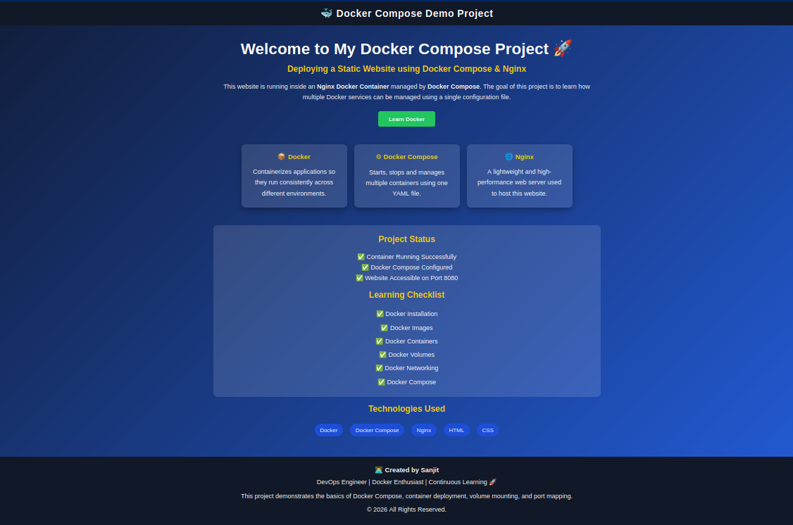

# Docker Compose - Static Website

## Overview

This project demonstrates how to deploy a static website using Docker Compose and Nginx.

## Project Structure

```text
docker-compose-nginx/
│
├── docker-compose.yml
├── README.md
│
├── website/
│   └── index.html
│
└── screenshots/
    └── home-page.png
```

## Technologies Used

- Docker
- Docker Compose
- Nginx
- HTML
- CSS

## Prerequisites

- Docker Desktop or Docker Engine
- Docker Compose

## Run the Project

```bash
docker compose up -d
```

Open your browser:

```
http://localhost:8080
```

## Stop the Project

```bash
docker compose down
```

## Commands Used

```bash
docker compose up -d
docker compose ps
docker compose logs
docker compose stop
docker compose start
docker compose restart
docker compose down
```

## Screenshot



## Learning Outcomes

- Deploy a website using Docker Compose
- Understand port mapping
- Understand volume mounting
- Learn basic Docker Compose commands
