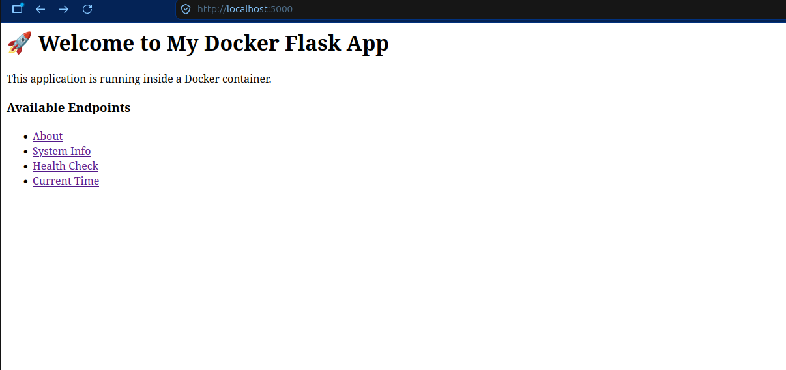
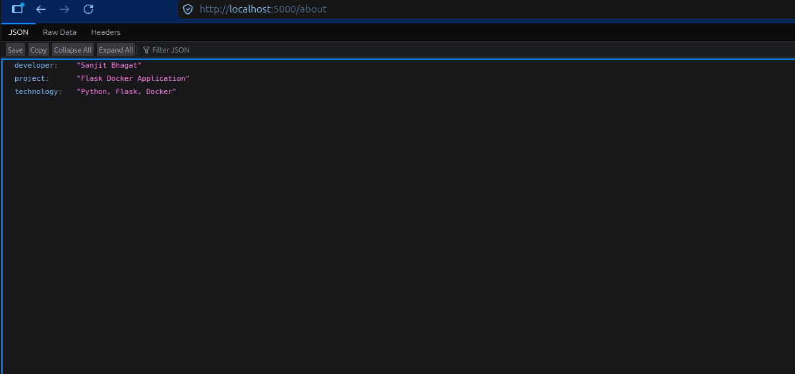
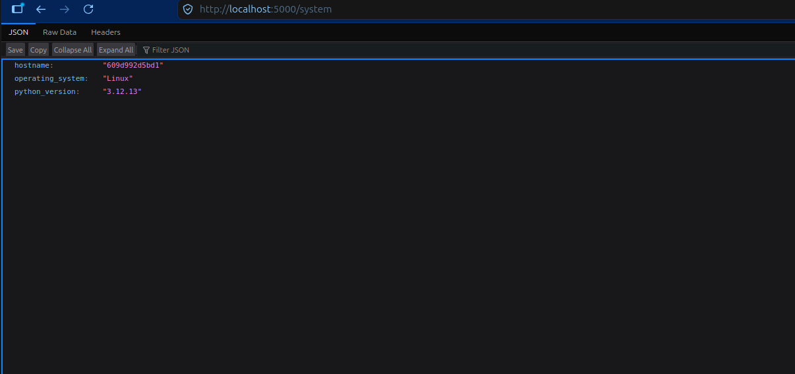
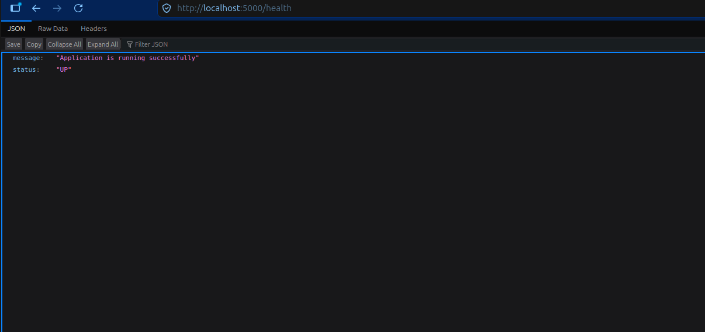
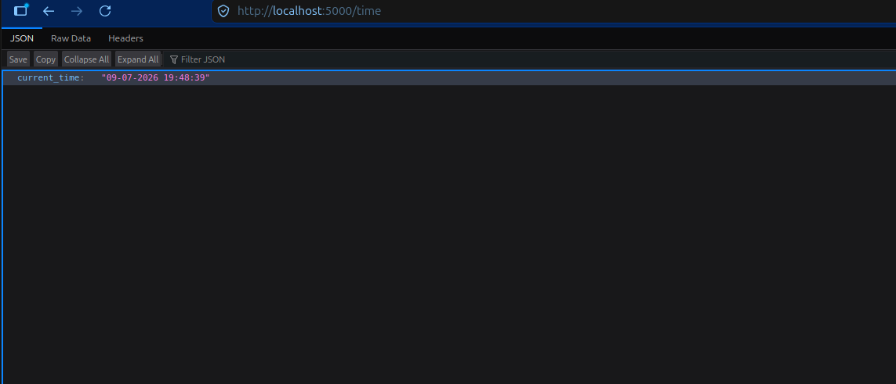

# 🐳 Flask Docker Application

A beginner-friendly Flask web application containerized using Docker. This project demonstrates how to package a Python web application into a Docker container and run it consistently across different environments.

---

## 📖 Project Overview

This project is built using **Python**, **Flask**, and **Docker**. It provides multiple endpoints to display application information, system details, health status, and current time.

The main goal of this project is to learn how to:

- Create a Flask web application
- Write a Dockerfile
- Build a Docker image
- Run a Docker container
- Expose application ports
- Access the application from a web browser

---

## ✨ Features

- 🏠 Home Page
- ℹ️ About Page
- 💻 System Information
- ❤️ Health Check Endpoint
- 🕒 Current Date & Time
- 🐳 Dockerized Application

---

## 🛠️ Technologies Used

- Python 3.12
- Flask
- Docker

---

## 📁 Project Structure

```text
flask-docker-app/
│── app.py
│── Dockerfile
│── requirements.txt
│── README.md
└── screenshots/
    ├── home-page.png
    ├── about-page.png
    ├── system-info.png
    ├── health-check.png
    └── current-time.png
```

---

## 🚀 Build Docker Image

```bash
docker build -t flask-app:v1 .
```

---

## ▶️ Run Docker Container

```bash
docker run -d --name flask-container -p 5000:5000 flask-app:v1
```

---

## 🌐 Access the Application

Open your browser and visit:

```
http://localhost:5000
```

Available Endpoints:

| Endpoint | Description |
|----------|-------------|
| `/` | Home Page |
| `/about` | Project Information |
| `/system` | System Information |
| `/health` | Application Health Status |
| `/time` | Current Date & Time |

---

---

# 📸 Screenshots

## 🏠 Home Page



---

## ℹ️ About Page



---

## 💻 System Information



---

## ❤️ Health Check



---

## 🕒 Current Time



---

## 🎯 Learning Outcomes

Through this project, I learned:

- Writing Dockerfiles
- Building Docker images
- Running Docker containers
- Port Mapping
- Docker Image Management
- Container Management
- Basic Flask Web Development
- Deploying Python applications using Docker

---

## 👨‍💻 Author

**Sanjit Bhagat**

